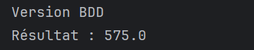

<h1>Inversion de contrôle & Injection des dépendances</h1>
<h2>1.L'interface IDao</h2>

<h2>2.Implémentation de L'interface IDao</h2>

<h2>3.L'interface IMetier</h2>

<h2>4.Implémentation de L'interface IMetier</h2>

<h2>5.L'Injection des dépendances</h2>
<h3>a.Par instanciation statique</h3>

<h4>Résultat :</h4>

<h3>b.Par instanciation dynamique</h3>

<h4>Résultat :</h4>

<h4>Fichier de configuration :</h4>

<h3>c.Entilisant Spring: XML</h3>

<h4>Résultat :</h4>

<h4>Fichier de configuration :</h4>

<h3>d.Entilisant Spring: Annotation</h3>

<h4>Résultat :</h4>

